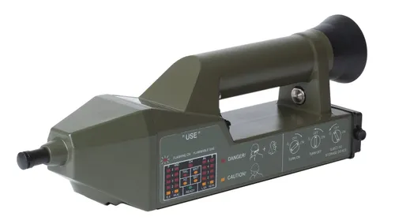
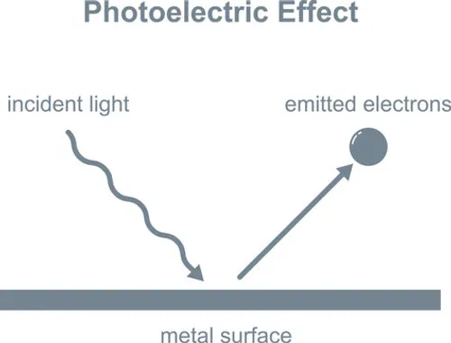
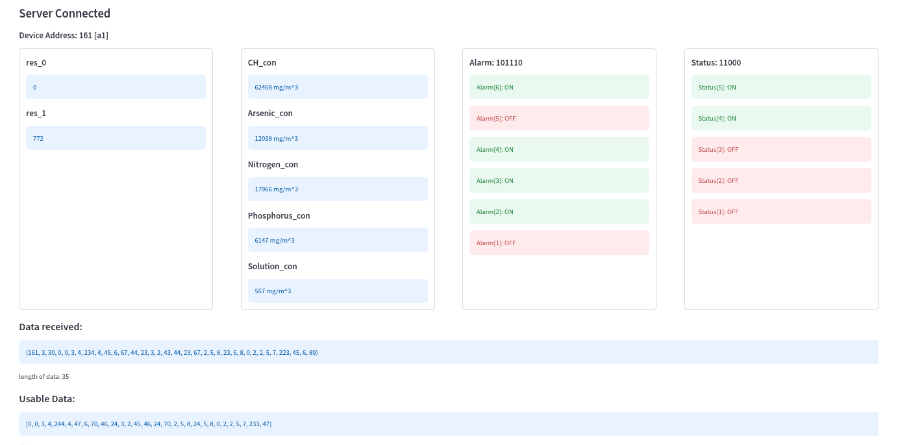

# AP4C-reading-Qualitative-to-Quantitative
with this program we are reading the values given by AP4C machine, and converting the Qualitative values to Quantitative values, before showing them on GUI interface

AP4C [ Apparatus 4 Channels ] is a chemical detection machine which takes a chemical sample as input and gives the concentration of 4 elements in the compound.
Which are mainly: 
<ul>
  <l>Phosphorus (P)</l>  
  <l>Sulfur (S)</l>  
  <l>Arsenic (As)</l>  
  <l>Hydrogen-Nitrogen-Oxygen (HNO)</l>  
  <l>Carbon-Hydrogen (CH)</l>  
</ul>

>The Carbon-Hydrogen are responsible for flame production in the machine to breake the sample compound into individual molecules.

>These molecules then release photons while dropping from higher octate [excited state] to lower octate [ground state] due to loss of enegry acuired by the flame produced.

>These photos are then collided to the metal plate to release electrons [Photo-Electric_Effect] , the density of these electrons manipulates the indication-light on the machine that give the idea about chemical concentration of particular molecule.

>The electron density is increased by a special method to turn the light on, as the raw electrons are significantly low in number to create a spark in the electric circuit and turn onn the LED.

